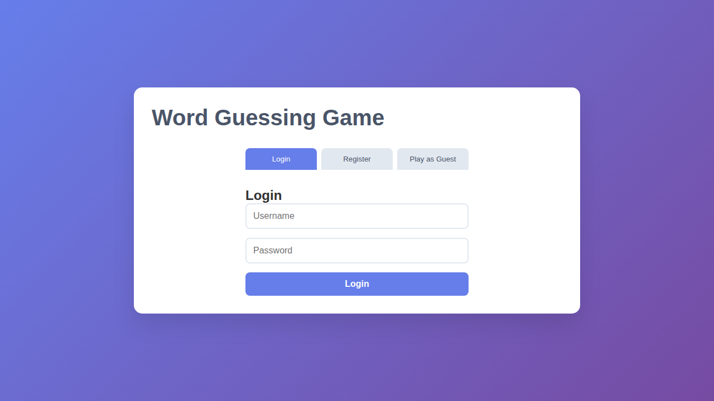
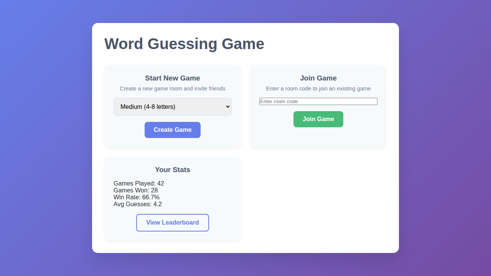
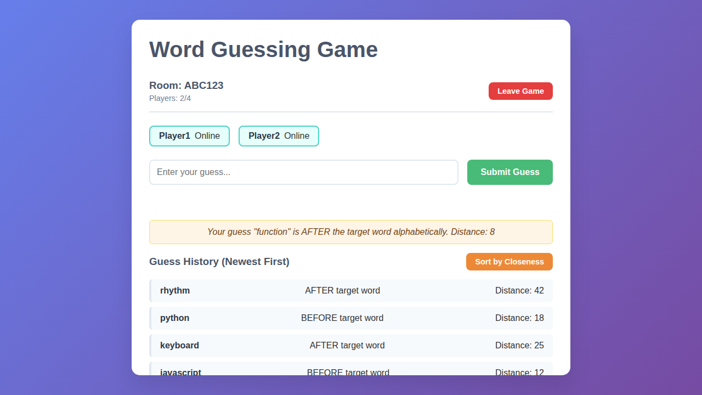
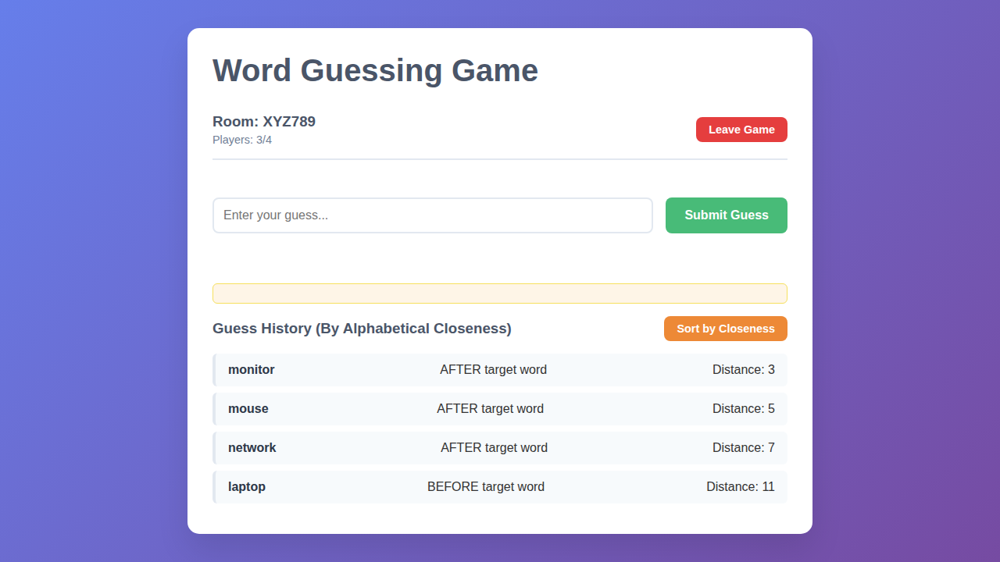
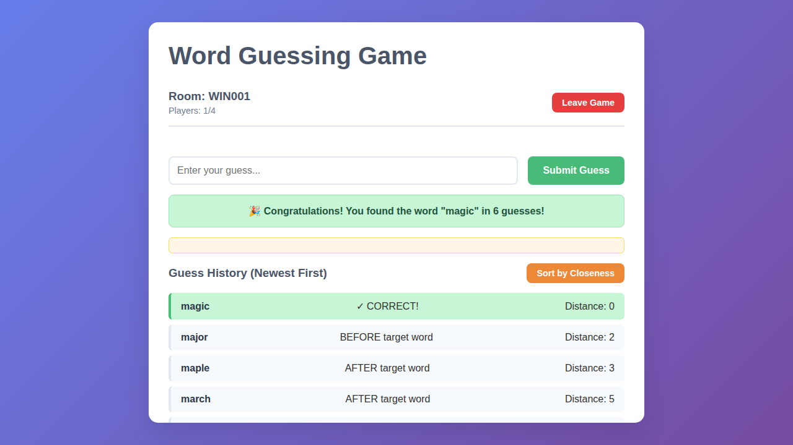
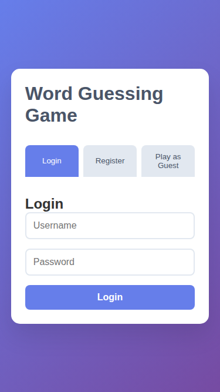
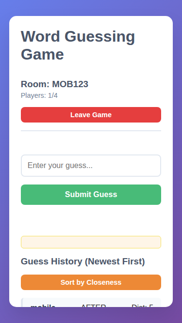

# Word Guessing Game - Demo & Tech Stack

A modern, real-time multiplayer word guessing game showcasing
full-stack web development with cloud deployment capabilities.

## 🎮 Game Demo

### Authentication System

The game features a comprehensive authentication system with multiple
entry points for different user preferences.

#### Login Interface



**Features:**

- Secure user authentication
- Username and password validation
- Session management with JWT tokens
- Password encryption using bcryptjs

#### Registration


**Features:**

- New user account creation
- Optional email for password recovery
- Display name customization
- Input validation and sanitization

#### Guest Mode


**Features:**

- Quick access without registration
- No commitment gameplay
- Anonymous user sessions
- Limited feature access (no progress saving)

### Game Menu



**Main Menu Features:**

- **Start New Game**: Create rooms with difficulty selection
  - Easy: 3-5 letter words
  - Medium: 4-8 letter words
  - Hard: 7-12 letter words
- **Join Game**: Enter room codes to join friends
- **Player Stats**: Track your gameplay metrics
  - Games played and won
  - Win rate percentage
  - Average guesses per game
- **Leaderboard Access**: View top players globally

### Active Gameplay



**Gameplay Features:**

- **Real-time Updates**: Instant feedback via Socket.IO
- **Room Information**: Display room code and player count
- **Active Players List**: See who's online in your room
- **Guess Input**: Type and submit your word guesses
- **Hint System**: Get alphabetical positioning hints
- **Distance Calculation**: See how close you are to the target
- **Guess History**: Track all previous attempts

### Sorted Guesses View



**Advanced Features:**

- **Sort Toggle**: Switch between newest first and closest first
- **Visual Indicators**: Highlight closest guesses
- **Distance Metrics**: Quantify alphabetical distance
- **Smart Hints**: BEFORE/AFTER indicators for navigation

### Winning State



**Victory Features:**

- **Success Animation**: Celebratory visual feedback
- **Performance Stats**: Display guess count and time
- **Score Calculation**: Based on guesses and time elapsed
- **Achievement System**: Unlock badges and milestones
- **Game Summary**: Complete history of the winning attempt

### Mobile Responsive Design

#### Mobile Authentication



#### Mobile Gameplay



**Mobile Features:**

- **Fully Responsive**: Optimized for all screen sizes
- **Touch-Friendly**: Large tap targets and gestures
- **Adaptive Layout**: Column layout on smaller screens
- **Performance Optimized**: Fast load times on mobile networks

## 🛠️ Tech Stack

### Frontend Technologies

| Technology  | Version | Purpose                       |
| ----------- | ------- | ----------------------------- |
| **HTML5**   | -       | Semantic markup structure     |
| **CSS3**    | -       | Modern styling with Flexbox   |
| **Vanilla JS** | ES2020+ | Client-side logic          |
| **Socket.IO Client** | ^4.8.1 | Real-time communication |

**Frontend Features:**

- Modern ES6+ JavaScript with modules
- CSS custom properties for theming
- Responsive design with mobile-first approach
- WebSocket integration for real-time updates
- Local storage for session persistence
- Progressive enhancement strategy

### Backend Technologies

| Technology          | Version | Purpose                        |
| ------------------- | ------- | ------------------------------ |
| **Node.js**         | 18+     | Runtime environment            |
| **Express.js**      | ^4.18.2 | Web application framework      |
| **Socket.IO**       | ^4.8.1  | WebSocket server               |
| **PostgreSQL**      | 15      | Primary database               |
| **Redis**           | 7       | Caching and session store      |
| **Winston**         | ^3.11.0 | Structured logging             |
| **Helmet**          | ^7.1.0  | Security middleware            |
| **CORS**            | ^2.8.5  | Cross-origin resource sharing  |
| **express-rate-limit** | ^7.1.5 | API rate limiting         |

**Backend Architecture:**

- RESTful API design
- WebSocket event-driven architecture
- Middleware-based request processing
- Connection pooling for database efficiency
- Redis-backed session management
- Structured error handling
- Request/response logging
- Security hardening out-of-the-box

### Database & Caching

#### PostgreSQL Database Schema

**Tables:**

- `users`: User accounts and authentication
- `games`: Game sessions and metadata
- `guesses`: Player guess history
- `achievements`: User achievement tracking
- `leaderboard`: Global and room-specific rankings

**Features:**

- ACID compliance for data integrity
- Indexed queries for performance
- Foreign key constraints
- Transaction support for complex operations
- Connection pooling (max 20 connections)

#### Redis Caching

**Use Cases:**

- Session storage with express-session
- Active game state caching
- Player connection tracking
- Rate limiting counters
- Temporary data with TTL
- Real-time leaderboard updates

**Configuration:**

- Append-only file persistence
- In-memory data structure store
- Pub/sub for real-time notifications

### Development Tools

| Tool              | Version | Purpose                      |
| ----------------- | ------- | ---------------------------- |
| **Jest**          | ^29.7.0 | Unit testing framework       |
| **Playwright**    | ^1.40.1 | End-to-end testing           |
| **ESLint**        | ^8.56.0 | Code linting                 |
| **Prettier**      | ^3.1.1  | Code formatting              |
| **Husky**         | ^8.0.3  | Git hooks                    |
| **lint-staged**   | ^15.2.0 | Pre-commit validation        |
| **Nodemon**       | ^3.0.2  | Development auto-reload      |
| **Supertest**     | ^6.3.3  | HTTP assertion testing       |

**Development Workflow:**

- Pre-commit hooks for code quality
- Automated testing on pull requests
- Code coverage reporting
- Conventional commit messages
- Branch protection rules
- Continuous integration with GitHub Actions

### DevOps & Infrastructure

#### Containerization

| Technology         | Version | Purpose                      |
| ------------------ | ------- | ---------------------------- |
| **Docker**         | 24+     | Application containerization |
| **Docker Compose** | 2.x     | Multi-container orchestration|

**Container Architecture:**

- Multi-stage Docker builds
- Alpine Linux base images
- Separate containers for app, DB, and cache
- Volume mounting for data persistence
- Bridge networking for inter-container communication
- Health checks for service monitoring

#### Infrastructure as Code

| Technology           | Purpose                          |
| -------------------- | -------------------------------- |
| **PowerShell**       | Server provisioning automation   |
| **Bash Scripts**     | Deployment and setup automation  |
| **GitHub Actions**   | CI/CD pipeline orchestration     |
| **Systemd**          | Service management on Linux      |

**IaC Features:**

- Automated server provisioning
- Idempotent deployment scripts
- Environment-specific configurations
- Secret management
- Infrastructure validation
- Rollback capabilities

#### Cloud Deployment

**Supported Platforms:**

1. **Binary Lane** (Primary)
   - VPS hosting in Australia
   - Custom server provisioning
   - Direct SSH access
   - Full system control

2. **Azure Web Apps** (Secondary)
   - Platform as a Service (PaaS)
   - Managed scaling
   - Built-in monitoring

3. **Docker Compose** (Development)
   - Local development environment
   - Service orchestration
   - Volume management

**Deployment Features:**

- Automated SSL certificate provisioning (Let's Encrypt)
- Zero-downtime deployments
- Health check monitoring
- Automatic failover capabilities
- Load balancer configuration (Nginx)
- CDN integration ready

### Security Features

| Feature                    | Implementation                     |
| -------------------------- | ---------------------------------- |
| **Authentication**         | JWT with bcryptjs password hashing |
| **Session Management**     | Redis-backed sessions with TTL     |
| **HTTPS**                  | Let's Encrypt SSL certificates     |
| **Security Headers**       | Helmet.js middleware               |
| **Rate Limiting**          | express-rate-limit                 |
| **Input Validation**       | Custom validation middleware       |
| **SQL Injection Prevention** | Parameterized queries            |
| **XSS Protection**         | Content Security Policy            |
| **CSRF Protection**        | Token-based validation             |

**Server Hardening:**

- SSH key-only authentication
- Custom SSH port (2025)
- UFW firewall configuration
- Fail2ban for intrusion prevention
- Automatic security updates
- Minimal port exposure
- Root login disabled

### Testing Strategy

#### Unit Tests (Jest)

- **Coverage Target**: 80%+
- **Test Types**:
  - Model validation tests
  - Business logic tests
  - Utility function tests
  - Middleware tests
- **Features**:
  - Snapshot testing
  - Mock implementations
  - Code coverage reporting
  - Watch mode for development

#### Integration Tests (Jest + Supertest)

- API endpoint testing
- Database interaction tests
- Session management tests
- WebSocket event tests

#### End-to-End Tests (Playwright)

- **Browser Coverage**:
  - Chromium (Desktop)
  - Firefox (Desktop)
  - WebKit (Safari)
  - Mobile Chrome (Pixel 5)
  - Mobile Safari (iPhone 12)
- **Test Scenarios**:
  - User authentication flows
  - Game creation and joining
  - Real-time gameplay
  - Multiplayer interactions
  - Responsive design validation

### Monitoring & Logging

**Logging Stack:**

- **Winston**: Structured application logging
- **Log Levels**: error, warn, info, debug
- **Log Rotation**: Daily with size limits
- **Centralized Logs**: Aggregated in `/var/log/`

**Monitoring Features:**

- Health check endpoints
- Uptime Robot integration
- Application performance metrics
- Database connection pool monitoring
- Redis cache hit rate tracking
- Real-time error alerting

### Performance Optimizations

**Frontend:**

- CSS minification in production
- JavaScript bundling considerations
- Lazy loading of images
- Efficient DOM manipulation
- Debounced input handling

**Backend:**

- Database query optimization
- Connection pooling (PostgreSQL)
- Redis caching strategy
- Gzip compression
- Static asset caching
- Rate limiting to prevent abuse

**Infrastructure:**

- CDN for static assets (ready)
- Load balancing configuration
- Horizontal scaling capability
- Database read replicas (ready)
- Session store clustering

## 📊 System Architecture

```
                          ┌─────────────────┐
                          │   Load Balancer │
                          │     (Nginx)     │
                          └────────┬────────┘
                                   │
                    ┌──────────────┼──────────────┐
                    │              │              │
            ┌───────▼──────┐ ┌────▼─────┐ ┌──────▼──────┐
            │ Node.js App  │ │ Node.js  │ │ Node.js App │
            │  (Primary)   │ │  (App 2) │ │  (App N)    │
            └───────┬──────┘ └────┬─────┘ └──────┬──────┘
                    │              │              │
                    └──────────────┼──────────────┘
                                   │
                    ┌──────────────┼──────────────┐
                    │              │              │
            ┌───────▼──────┐ ┌────▼─────┐ ┌──────▼──────┐
            │  PostgreSQL  │ │  Redis   │ │   Static    │
            │  (Database)  │ │ (Cache)  │ │   Assets    │
            └──────────────┘ └──────────┘ └─────────────┘
```

### Data Flow

1. **Client Request** → Load Balancer (Nginx)
2. **Load Balancer** → Node.js Application Server
3. **Application** → Redis (session/cache check)
4. **Application** → PostgreSQL (data operations)
5. **Application** → Socket.IO (real-time events)
6. **Response** → Client

### WebSocket Architecture

```
┌─────────┐                 ┌─────────────┐
│ Client  │◄───WebSocket───►│  Socket.IO  │
│ Browser │                 │   Server    │
└─────────┘                 └──────┬──────┘
                                   │
┌─────────┐                 ┌──────▼──────┐
│ Client  │◄───WebSocket───►│   Redis     │
│ Browser │                 │   Pub/Sub   │
└─────────┘                 └─────────────┘
```

## 🚀 Development Setup

### Prerequisites

- Node.js 18+ and npm 9+
- Docker & Docker Compose
- PostgreSQL 15+ (or use Docker)
- Redis 7+ (or use Docker)
- Git

### Local Development

```bash
# Clone repository
git clone https://github.com/time-by-waves/word-guessing-game.git
cd word-guessing-game

# Install dependencies
npm install

# Setup environment
cp .env.example .env
# Edit .env with your local configuration

# Start services with Docker
docker compose up -d

# Prepare database
npm run prepare-dev

# Start development server
npm run dev
```

### Running Tests

```bash
# Unit tests
npm test

# E2E tests
npm run test:e2e

# Generate coverage
npm run test:coverage

# Watch mode
npm run test:watch
```

### Code Quality

```bash
# Lint code
npm run lint

# Fix linting issues
npm run lint:fix

# Format code
npm run format

# Check formatting
npm run format:check
```

## 📈 Performance Metrics

### Application Performance

- **Cold Start**: < 3 seconds
- **Page Load Time**: < 1 second
- **API Response Time**: < 100ms (average)
- **WebSocket Latency**: < 50ms
- **Database Query Time**: < 20ms (average)

### Scalability

- **Concurrent Users**: 1000+ per instance
- **WebSocket Connections**: 5000+ per instance
- **Database Connections**: 20 connection pool
- **Cache Hit Rate**: > 90% (target)
- **Uptime**: 99.9% (target)

## 🔐 Security Compliance

- **OWASP Top 10**: Protected against common vulnerabilities
- **GDPR Ready**: User data protection and privacy
- **Password Policy**: Bcrypt hashing with salt rounds
- **Session Security**: HttpOnly, Secure, SameSite cookies
- **Rate Limiting**: 100 requests per 15 minutes per IP
- **SQL Injection**: Parameterized queries only
- **XSS Protection**: Content Security Policy headers
- **CSRF Protection**: Token validation on state changes

## 📝 API Documentation

### REST Endpoints

```
POST   /api/auth/register     - Register new user
POST   /api/auth/login        - User login
POST   /api/auth/logout       - User logout
GET    /api/auth/me           - Get current user
POST   /api/games             - Create new game
GET    /api/games/:id         - Get game details
POST   /api/games/:id/join    - Join game room
POST   /api/games/:id/guess   - Submit guess
GET    /api/leaderboard       - Get leaderboard
GET    /api/stats             - Get player stats
GET    /health                - Health check endpoint
```

### WebSocket Events

**Client → Server:**

```javascript
socket.emit('game:create', { difficulty: 'medium' });
socket.emit('game:join', { roomCode: 'ABC123' });
socket.emit('game:guess', { word: 'example' });
socket.emit('game:leave');
```

**Server → Client:**

```javascript
socket.on('game:created', data => {
  /* room created */
});
socket.on('game:joined', data => {
  /* joined room */
});
socket.on('game:guess:result', data => {
  /* guess result */
});
socket.on('game:won', data => {
  /* game won */
});
socket.on('player:joined', data => {
  /* player joined */
});
socket.on('player:left', data => {
  /* player left */
});
```

## 🎯 Future Enhancements

### Planned Features

- [ ] Private rooms with passwords
- [ ] Custom word lists
- [ ] Tournament mode
- [ ] Team gameplay
- [ ] Voice chat integration
- [ ] Progressive Web App (PWA)
- [ ] Push notifications
- [ ] Social media integration
- [ ] Internationalization (i18n)
- [ ] Dark mode theme

### Infrastructure Improvements

- [ ] Kubernetes orchestration
- [ ] Multi-region deployment
- [ ] Advanced monitoring (Prometheus/Grafana)
- [ ] Automated backup system
- [ ] Blue-green deployment
- [ ] A/B testing framework
- [ ] Performance profiling tools

## 📞 Contact & Support

- **Repository**:
  [github.com/time-by-waves/word-guessing-game](https://github.com/time-by-waves/word-guessing-game)
- **Issues**: Report bugs or request features via GitHub Issues
- **Discussions**: Join community discussions on GitHub
- **Documentation**: Check the `wiki/` directory for detailed guides

## 📄 License

This project is released into the public domain under the
[Unlicense](LICENSE). Feel free to use it for your portfolio, learning,
or commercial projects.

---

**Built with ❤️ using modern web technologies**

_Last updated: December 2024_
